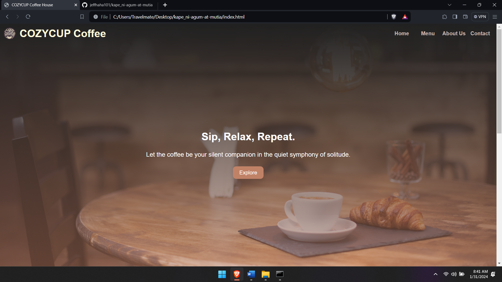
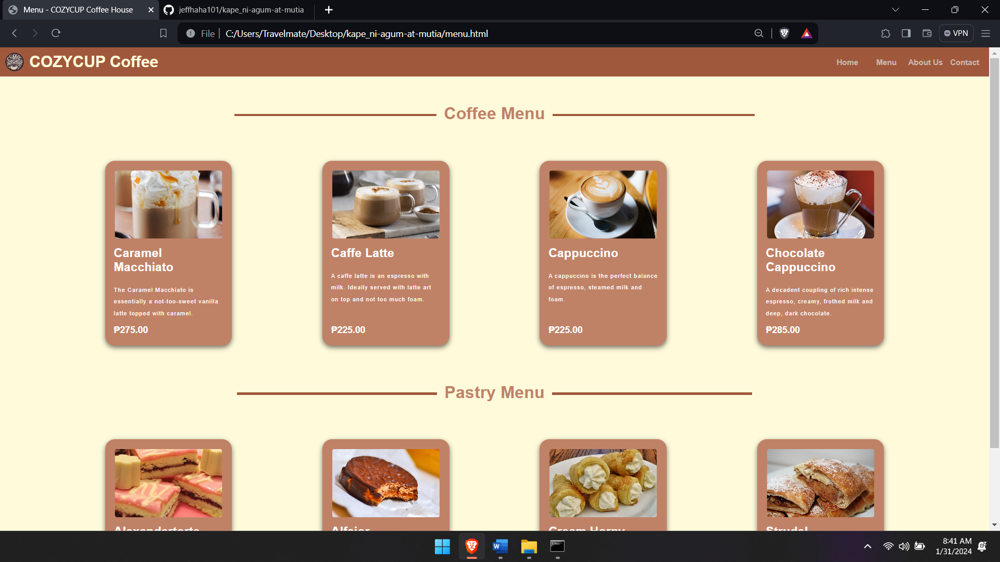
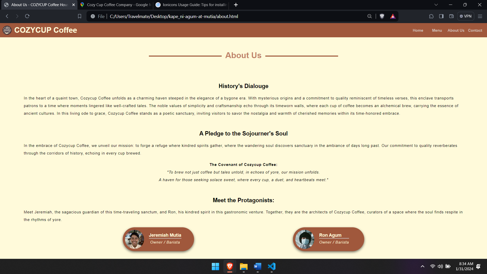
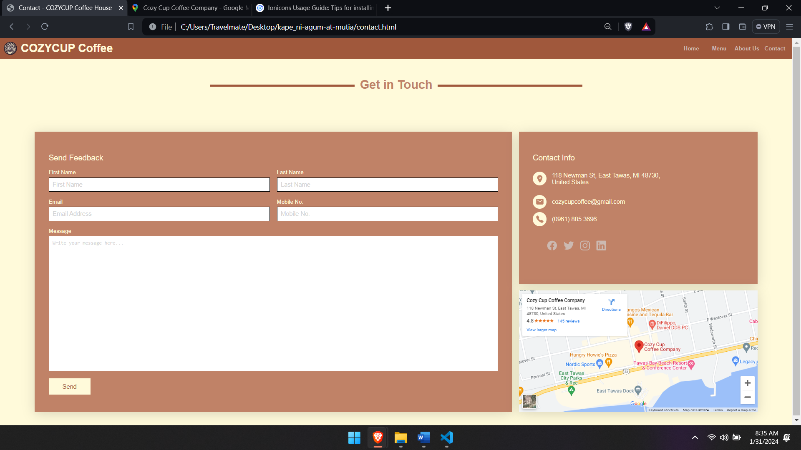

# Cozy Cup Coffee 

## Project Description 
Cozy Cup Coffee is a web-based application designed to streamline and enhance the cafe experience for both customers and staff. The goal is to provide a cozy and efficient environment for ordering and enjoying your favorite beverages and snacks.

## Features 
- User-friendly Interface: A clean and intuitive interface for easy navigation.
- Menu Management: Browse a variety of beverages and snacks with detailed descriptions.

## Screen Captures 

### Home Page

### Menu Page

### About us

### Contact

### About the Authors

#### Jeremiah A. Mutia

#### Ronnillynuel James Agum

## Contact Us

Feel free to contact us for deliveries and reservation. You are always welcome to CozyCup Coffee.

 **Name:** Ronnillynuel James Agum

 **Email:** 202180414@psu.palawan.edu.ph

 **Name:** Jeremiah A. Mutia

 **Email:** 202180201@psu.palawan.edu.ph

 --- 

***&copy; 2023 CozyCup Coffee. All Rights Reserved.**

Connect with us on our social media:

**Jeremiah Mutia**

(https://www.facebook.com/jeremiah.mutia.03)

(https://github.com/jeffhaha101)

**Ronnillynuel James Agum**

(https://www.facebook.com/ronxxxron)

(https://github.com/rondonbrij)

